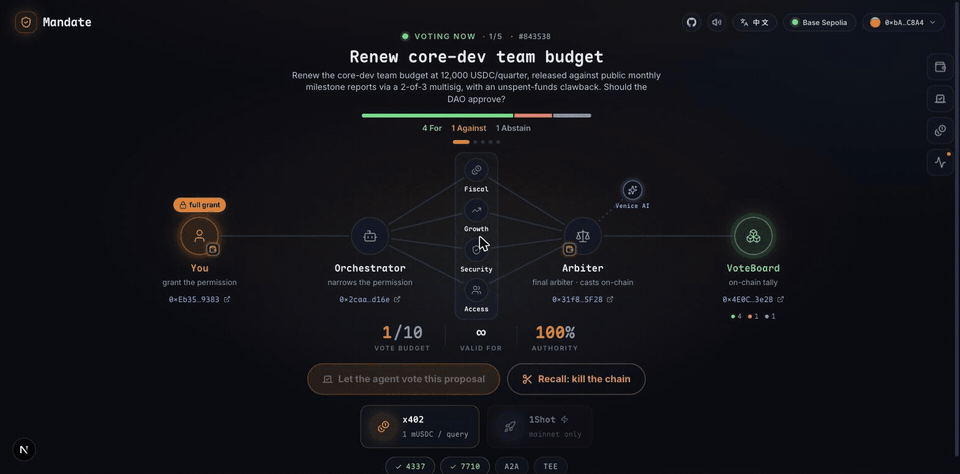

<div align="center">


# Regent

A revocable AI regency over your DAO votes. You stay sovereign: the regency is scoped,
bounded, and revocable on-chain in one click.

[**English**](./README.md) · [简体中文](./README.zh-CN.md)

[](https://mandate-app-murex.vercel.app)
[](https://www.youtube.com/watch?v=55HJ_LHQdqY)
[](https://basescan.org/tx/0xc48632ca8bc72db8c68eabd3e7dde90c5eae37b6afef60e70b1e686a8f8b5092)
[](https://eips.ethereum.org/EIPS/eip-7710)
[](https://eips.ethereum.org/EIPS/eip-7702)
[](#-quick-start)
[](./LICENSE)

[Live demo](https://mandate-app-murex.vercel.app) · [Demo video](https://www.youtube.com/watch?v=55HJ_LHQdqY) · [On-chain evidence](./EVIDENCE.md) · [Architecture](./ARCHITECTURE.md) · [Submission](./SUBMISSION.md) · [Feedback](./FEEDBACK.md)


<sub>The recorded Base mainnet run replaying in the app. A 3-hop delegation chain, a Venice TEE
committee, an x402 toll and a 1Shot relay; the vote lands as the user's own smart account, and
every artifact links to Basescan.</sub>

</div>

---

Regent lets you hand an AI the right to vote your DAO governance without handing it anything
else. One MetaMask signature creates an ERC-7710 delegation that can call `castVote` on one
board and nothing more, capped to a number of votes and an expiry you choose. The agent then
votes proposal after proposal on its own. The moment you stop trusting it, a single on-chain
call revokes the whole delegation chain, and the next attempt to vote reverts.

Built for the MetaMask Smart Accounts Kit x 1Shot API x Venice AI Dev Cook-Off (submission due
2026-06-15).

## ▶️ Try it

Prefer to watch first? Here is the full walkthrough:

<a href="https://www.youtube.com/watch?v=55HJ_LHQdqY">
  
</a>

**[Open the live demo →](https://mandate-app-murex.vercel.app)** and drive the whole thing in your
browser, no install and no wallet funding needed: connect any wallet, grant one scoped ERC-7710
mandate, watch the Venice TEE committee decide and the agent cast on Base Sepolia, see the x402 toll
settle per vote, then recall the chain in one click. The app is wired to a hosted orchestrator, so
the live flow works for anyone who opens the link. Toggle the network pill to **Base Mainnet** for
the recorded real-funds run. The deploy, the gas and the recall are all sponsored, and the
orchestrator mints the connected smart account its mUSDC x402 budget at grant, so a brand-new wallet
needs nothing.

To run the full stack yourself (development, or to point the app at your own orchestrator):

```bash
git clone https://github.com/beautifulrem/regent && cd regent
pnpm install
pnpm bootstrap:accounts          # throwaway keys into .env + a faucet checklist
pnpm proposal --reseed --wait    # open a fresh 300s Active proposal
pnpm --filter @mandate/orchestrator serve   # the orchestrator on :8787
pnpm --filter @mandate/app dev              # the app on :3000
```

## ✨ What's in the box

- A standing, vote-only mandate: one ERC-7710 grant covers any proposal on the board, bounded
  by `LimitedCalls` and `Timestamp` caveats. The agent cannot move funds; the in-app Tamper
  Probe shows the forbidden call reverting at the enforcer, live.
- A one-click kill switch. `disableDelegation(root)` cascade-revokes every downstream agent;
  the next redemption reverts on-chain.
- Agent-to-agent attenuation: user to orchestrator to analyst, each hop strictly narrower,
  validated on-chain at redemption.
- A Venice TEE committee. Four analysis lenses plus an arbiter decide every vote on Venice's
  attested Intel TDX confidential-compute endpoints (`x-venice-tee: true`, `/tee/attestation`:
  verified flag, enclave signing address, fresh nonce, TDX quote), with a spoken verdict over
  `/audio/speech`. We rely on Venice's attested enclave; we do not independently bind the quote
  to each individual completion or verify a MRENCLAVE measurement.
- x402 pay-per-query: the agent buys proposal data with a 0.001 USDC toll from a scoped
  `Erc20TransferAmount` budget, settled on-chain.
- Zero-ETH voting on Base mainnet through the 1Shot permissionless relayer. The 3-hop chain is
  redeemed in one relay call; `castVote` executes as the user's smart account, the user's
  EIP-7702 upgrade rides the same call, a sponsor account pays the USDC fee, and the relayer
  fronts the gas.
- Receipts for all of it. Every claim above links to a transaction in [EVIDENCE.md](./EVIDENCE.md).

## 🧭 How it works

1. Grant. Your MetaMask smart account signs one ERC-7710 delegation: the AI may `castVote` on
   any proposal on this board, within the vote cap and validity window you pick. The scope is
   enforced by `AllowedTargets` and `AllowedMethods`, the bounds by `LimitedCalls` and
   `Timestamp`.
2. Re-delegate. An orchestrator smart account re-delegates the right to an analyst with a
   narrower scope (`parentDelegation`). This hop is what makes the mandate attenuable and
   cascade-revocable.
3. Decide. The analyst reads each proposal inside a Venice TEE (Intel TDX) and decides For,
   Against or Abstain. The cast `support` comes from the model; the on-chain tally bucket
   matches the TEE decision.
4. Vote. The analyst redeems the chain leaf to root, and the DelegationManager executes
   `castVote` as your smart account. Under the one grant the agent keeps voting until it hits
   your cap.
5. Recall. One `disableDelegation` on the root revokes the whole chain. The next redemption
   reverts on-chain, and the app shows it happening.

The repo also ships a CLI path (`pnpm vote:2hop`) that runs the same mechanism against a real
OpenZeppelin `Governor`, with the scope tightened further to a single locked `proposalId`. It
exists for the on-chain Governor receipts in `EVIDENCE.md`.

### 🪙 Zero-gas membership

The recorded mainnet cast
([`0xc486…5092`](https://basescan.org/tx/0xc48632ca8bc72db8c68eabd3e7dde90c5eae37b6afef60e70b1e686a8f8b5092))
splits the vote into two delegations inside one atomic relay transaction, and that split maps
directly onto how a DAO would run this in production:

- Members sign authority and nothing else. The voter's key holds no ETH and no USDC; even its
  EIP-7702 upgrade rides the relay call. The voter of record on-chain is the member's own
  smart account.
- The DAO runs the fee sponsor: a treasury-funded account whose delegation can only transfer
  USDC to the relayer's fee collector, cappable per-transaction, by cumulative budget, and by
  expiry. It gains no voting power.
- 1Shot glues the two atomically and fronts the ETH gas. Either the vote lands and the fee is
  paid, or neither happens.

A DAO sets up the voting-gas account once; after that, members hold no gas at all. The sponsor
subsidises participation rather than direction; it signs before any decision exists, so it
cannot condition payment on how the vote goes. In this repo the sponsor role is played by a
disposable burner; in production it would be the DAO's operations treasury.

## 🧱 Why ERC-7710

Letting an AI vote your governance takes four properties at the same time, and weaker options
each give up at least one:

| Approach | Vote-only | Bounded | Revocable on-chain | Custody kept |
|---|:--:|:--:|:--:|:--:|
| Hand the agent a private key | no | no | key rotation only | no |
| Broad session key | no, can move funds | partial | partial | yes |
| `delegate()` voting power (ERC20Votes) | weight to an address, not a bounded mandate | no | re-delegating is not revoking | yes |
| Co-sign every vote | yes | n/a | n/a | yes, but not autonomous |
| Custodial voting service | yes | yes | trust the operator | no |
| Regent (scoped + revocable ERC-7710) | `AllowedMethods` = castVote, `AllowedTargets` = this board | `LimitedCalls` + `Timestamp` | `disableDelegation` cascades | the EVM enforces the scope |

DAOs already let you delegate voting weight to an address that votes however it likes. Regent
delegates a bounded task instead: vote on this board, at most N times, until this date, with
the direction decided per-proposal in a TEE, and the whole thing revocable without moving your
tokens. The Tamper Probe demonstrates the negative case live: ask the delegated agent to move
funds and the redemption reverts at the enforcer.

### Why a chain instead of flat grants

Remove `parentDelegation` and the product stops working:

- One signature, rotating workforce. You sign once, to the orchestrator. It can spin up,
  retire or replace analyst agents by re-delegating, each time narrower, without sending you
  back to MetaMask. Flat grants would mean a wallet popup per analyst.
- Attenuation is enforced at redemption. A child delegation can only narrow its parent; the
  DelegationManager checks the analyst's scope against the parent's authority on-chain, so the
  orchestrator cannot hand out more than it holds.
- The kill switch depends on the chain structure. Every leaf hangs off the root by parent
  hash, so one `disableDelegation(root)` revokes every downstream agent at once. With flat
  grants you would chase N separate revocations while a rogue agent keeps voting.

## 🔭 Testnet and mainnet

<div align="center">



<sub>A live Base Sepolia vote under a standing mandate, recorded as it ran. One click, no new
signature: re-delegation, the Venice committee deliberating, the x402 toll settling, and the
vote landing on the VoteBoard.</sub>

</div>

The app ships both networks on purpose; they answer different questions.

| | Base Sepolia (default) | Base mainnet |
|---|---|---|
| What it is | The live, interactive demo. Connect MetaMask, grant, watch each vote run, recall anytime | A replay of a recorded real run, plus a live `eth_getCode` 7702 check. Execution stays opt-in via CLI (`pnpm 1shot:full --mainnet`) |
| Delegation chain | 2-hop: you, orchestrator, analyst (standing: any proposal, vote cap, expiry) | 3-hop ending at the 1Shot target, the leaf locked to exactly `castVote(proposal, decidedSupport)` |
| Who casts, who pays gas | The analyst redeems the chain and pays testnet ETH from a faucet | The 1Shot relayer redeems. Nobody holds ETH: the burner sponsors the fee in USDC and 1Shot fronts the gas |
| x402 toll | 1 mUSDC (a 6-decimal mock) per query, pulled from the budget you sign at grant | 0.001 real USDC, paid by the deployed agent wallet |
| EIP-7702 | Not used; the smart accounts are Hybrid (ERC-4337), so no 7702 badge | The voter EOA upgrades in place inside the cast relay call; the 7702 badge lights at that beat |
| Recall | One click, live (a keyless UserOp) | Recorded evidence; reproducible live on Sepolia |
| Why it exists | Judges can drive every mechanic, free, in minutes | Shows the same mechanism working with real funds |

Same product, same code path up to the cast: the testnet is where you verify the mechanics by
hand, and the mainnet run shows them working with real funds. The live Base Sepolia flow is wired
to a hosted orchestrator, so it works straight from the deployed link (you can also run your own
locally; see **▶️ Try it** above). Tip: open `localhost:3000/?run=<runId>` to watch any orchestrator
run live in the cockpit; the CLI verify scripts print the id.

## 🌐 Deployed contracts

Base Sepolia (84532), the live demo:

| | Address | Used by |
|---|---|---|
| VoteBoard (multi-proposal board) | [`0x4E0CA4E2c45a94bC5974Fab93c3F1Df55F0c3e2B`](https://sepolia.basescan.org/address/0x4E0CA4E2c45a94bC5974Fab93c3F1Df55F0c3e2B) | the app demo; the standing vote-only mandate casts here |
| VotesToken (ERC20Votes) | [`0x56FC5fA996f9D0e15e40fE7D738C6cA055d1Ad55`](https://sepolia.basescan.org/address/0x56FC5fA996f9D0e15e40fE7D738C6cA055d1Ad55) | the CLI / Governor path |
| MandateGovernor (OZ) | [`0x1BC00C1c14bE7eaC46237C4bcBD0530bb9655FD5`](https://sepolia.basescan.org/address/0x1BC00C1c14bE7eaC46237C4bcBD0530bb9655FD5) | the CLI `vote:2hop` path (locked `proposalId`) |

Base mainnet (8453), the recorded full-chain run:

| | Address | Used by |
|---|---|---|
| VoteBoard (mainnet) | [`0x0B878c4A25002c14602ea8b25fD0099Ad6CEebeF`](https://basescan.org/address/0x0B878c4A25002c14602ea8b25fD0099Ad6CEebeF) | the 1Shot-relayed mainnet cast the app replays |

Per-track receipts live in [EVIDENCE.md](./EVIDENCE.md).

## 🏆 Hackathon tracks

In one sentence: a standing, vote-only, revocable AI governance mandate. An agent votes any
proposal on the DAO for you, cannot touch your funds, and you can revoke the whole delegation
chain on-chain in one click. The A2A re-delegation, the Venice TEE, x402 and
1Shot below are the mechanism that makes that real.

| Track | Status | Evidence |
|---|---|---|
| General qualification: SAK smart account + ERC-7710 standing grant in the main flow | live | grant signing in [`app/src/lib/wallet.ts`](./app/src/lib/wallet.ts); redeem tx [`0xc9f4…4841`](https://sepolia.basescan.org/tx/0xc9f49a3ba3020deb40cdb2fc27c9247caabf8333adea15ce6edf6d4ff2ef4841) |
| Revocable mandate + kill-the-chain (the core): recall disables the root, the next redemption reverts | live | disable UserOp [`0x1475…c74b`](https://sepolia.basescan.org/tx/0x147517e3b3120bb2bc60ee98a0de2017b4d4412ad9cbf58d06954a8e4d4dc74b); `canRedeem` flips true to false; reproduce with `pnpm revoke:2hop` |
| Best use of Venice AI: the TEE model decides `support` per proposal; four Venice endpoints in the main flow (`/models`, `/chat/completions`, `/tee/attestation`, `/audio/speech`; the arbiter speaks its verdict) | live | decisions discriminate (risky proposals go Against, sound ones For); `x-venice-tee: true`; attestation verified; spoken verdict via `tts-kokoro`; see [EVIDENCE](./EVIDENCE.md#best-venice-ai-live) |
| Best Agent: one grant, then autonomous analyze / decide / vote, proposal after proposal | live | `pnpm orchestrate`; the on-chain tally bucket equals the Venice decision; redeem tx [`0xd830…1356`](https://sepolia.basescan.org/tx/0xd8303a62b68b21e8f9578e054061de64fcab5880084973feb30026326b6c1356) |
| Best A2A coordination: 2-hop attenuated re-delegation | live | 3 participants, 2 signed delegations, leaf-to-root redemption; see [EVIDENCE](./EVIDENCE.md#checkpoint-a--best-a2a-live-base-sepolia) |
| Best 1Shot Permissionless Relayer: the full chain in one mainnet relay. The 3-hop chain redeemed, `castVote` executed as the user SA, the user's 7702 upgrade in the same call, the burner sponsoring the USDC fee; plus a signed-webhook status feed (Ed25519 events verified against the relayer JWKS) | live on Base mainnet | castVote tx [`0xc486…5092`](https://basescan.org/tx/0xc48632ca8bc72db8c68eabd3e7dde90c5eae37b6afef60e70b1e686a8f8b5092) (`getVote(proposal, userSA) = 2`); x402 toll tx [`0xb244…6174`](https://basescan.org/tx/0xb244c3e4b9c701bea6eb8812caf0b71f6d23ab29c6c3084d69bc421deefd6174); fee 0.01 USDC, every authority key holds 0 ETH; webhook receiver [`server.ts`](./agent/orchestrator/src/server.ts), verifier [`oneshot.ts`](./packages/shared/src/oneshot.ts) |
| Best x402 + ERC-7710: a self-built seller, the agent paying per query through a scoped delegation | live | `pnpm x402:demo`: 402, then a scoped `Erc20TransferAmount` delegation, an on-chain settle, then the data |

## 🚀 Quick start

```bash
pnpm install
pnpm -r build && pnpm -r test          # 206 tests: 108 shared, 58 app, 25 Foundry, 15 agents

# one-time: generate throwaway demo keys into .env and print a funding checklist
pnpm bootstrap:accounts                 # then fund the printed addresses from a Base Sepolia faucet

# reproduce the core mechanics on Base Sepolia (testnet gas only):
pnpm vote:2hop                          # 2-hop attenuated delegation, castVote on the Governor
pnpm revoke:2hop                        # kill the chain: disable the root, the fresh chain reverts
pnpm orchestrate                        # autonomous: grant, Venice TEE decision, real vote
pnpm proposal --reseed --wait           # refresh the 300-second active proposal window

# the full UI demo (two terminals):
pnpm --filter @mandate/orchestrator serve     # run API on :8787
pnpm --filter @mandate/app dev                # Next.js on :3000; connect MetaMask, grant, recall
```

The demo wallet must be the seeded voter: import the `.env` `USER_DEMO_PK` into MetaMask so the
connected smart account is the one holding voting power.

## 🗺️ Architecture

See [ARCHITECTURE.md](./ARCHITECTURE.md) ([中文](./ARCHITECTURE.zh-CN.md)). In short, a pnpm
monorepo. Code identifiers keep the project's original working name: the `@mandate/*` packages
and the deployed `MandateGovernor` contract predate the rename to Regent.

```
packages/shared/      delegation (ERC-7710), Governor and proposal helpers, Venice client,
                      1Shot client, the zod run contract
packages/contracts/   Foundry: VotesToken (ERC20Votes, timestamp clock), MandateGovernor,
                      deploy and propose scripts
agent/orchestrator/   HTTP service: holds the root, re-delegates with narrower scope, drives
                      the run state machine (SSE stream, 1Shot webhook receiver, Venice TTS proxy)
agent/analyst/        decides support in the Venice TEE and casts by redeeming the chain
agent/mandate-mcp/    MCP server: any agent can describe or request a mandate, but the request
                      comes back unsigned; only the human's MetaMask account can grant
app/                  Next.js 15: connect, grant in the browser, live authority graph, recall
```

## 🛠️ Stack

`@metamask/smart-accounts-kit@1.6.0` (ERC-7710 delegation and re-delegation, EIP-7702, Hybrid
smart accounts), `viem`, OpenZeppelin Contracts 5.6.1 with Foundry, Venice AI (TEE `e2ee-*`
models, `/tee/attestation`), the 1Shot permissionless relayer (mainnet JSON-RPC, signed Ed25519
status webhooks), the Pimlico public bundler for UserOps, Next.js 15 / React 19, SSE run
streaming with a polling fallback, an MCP server, Base (Sepolia 84532, mainnet 8453).

## 🔌 Smart Accounts Kit surface

Every delegation primitive is the real SDK, verified against
`@metamask/smart-accounts-kit@1.6.0`. See
[`packages/shared/src/delegation.ts`](./packages/shared/src/delegation.ts),
[`app/src/lib/wallet.ts`](./app/src/lib/wallet.ts) and
[`app/src/lib/recall.ts`](./app/src/lib/recall.ts).

| API | Where | Role |
|---|---|---|
| `toMetaMaskSmartAccount(Implementation.Hybrid)` | `wallet.ts`, agents | the user, orchestrator and analyst ERC-4337 smart accounts |
| `getSmartAccountsEnvironment(chainId)` | `delegation.ts` | resolves the DelegationManager and enforcer addresses per chain |
| `createDelegation({ scope, to, from, environment, salt })` | `delegation.ts` | the root grant |
| `createDelegation({ …, parentDelegation })` | `delegation.ts` | the attenuated re-delegation, parent-linked |
| `ScopeType.FunctionCall` (`targets`, `selectors`) | `delegation.ts` | pins the grant to `castVote` on this board; this is what blocks fund transfers |
| `createCaveatBuilder(env).addCaveat('timestamp' \| 'limitedCalls')` | `delegation.ts` | the standing bounds: expiry and vote cap |
| `account.signDelegation({ delegation })` | `wallet.ts`, orchestrator | the EIP-712 signature over each delegation |
| `createExecution({ target, callData })` + `ExecutionMode.SingleDefault` | `delegation.ts` | the `castVote` action the chain authorizes |
| `contracts.DelegationManager.encode.redeemDelegations(...)` | `delegation.ts` | the analyst redeems leaf to root; `castVote` executes as the user's smart account |
| `contracts.DelegationManager.encode.disableDelegation(...)` | `delegation.ts` | the kill switch; disabling the root cascade-revokes the chain |
| `createBundlerClient().sendUserOperation(...)` (viem AA, Pimlico) | `recall.ts` | the recall as a keyless UserOp from the user smart account |

Enforcers exercised: `AllowedTargetsEnforcer`, `AllowedMethodsEnforcer`, `TimestampEnforcer`,
`LimitedCallsEnforcer`, plus `AllowedCalldataEnforcer` on the single-proposal CLI path. The
decoded scope renders live in the app's Permission X-Ray.

Regent composes the **audited** stock MetaMask enforcers (no bespoke Solidity to trust) and
proves the scope holds on-chain: the committed Foundry fork test
[`MandateDelegation.fork.t.sol`](./packages/contracts/test/MandateDelegation.fork.t.sol) redeems a
real 2-hop delegation chain through the live Base Sepolia `DelegationManager` and asserts that an
honest `castVote` passes while wrong-method, wrong-`proposalId`, and post-`disableDelegation`
redemptions each revert at the named enforcer.

## ⚖️ Limitations

- The app's standing mandate runs on a self-built `VoteBoard`. The OpenZeppelin `Governor`
  path is the CLI reproduction (`pnpm vote:2hop`), same primitives, scope tightened to one
  locked `proposalId`. `votingPeriod` is 300 seconds so a judge can reproduce a full
  grant / vote / recall cycle in minutes.
- mUSDC is a mock. The x402 toll settles in a self-deployed 6-decimal token on Base Sepolia;
  the only real-USDC leg is the 1Shot mainnet relay fee (0.01 USDC).
- The x402 seller is self-built. It verifies and redeems the scoped delegation itself rather
  than settling through Coinbase's facilitator.
- Venice inference is prepaid through an API key; x402 pays for the proposal data, not the
  inference.
- The app's mainnet panel replays pinned artifacts from the recorded run (the castVote and
  toll transactions, linked to Basescan) and adds a live `eth_getCode` 7702 check. Live
  mainnet execution stays opt-in via the CLI (`pnpm 1shot:full --mainnet`; `--estimate` gives
  a free dry quote).
- The mainnet Governor and every proposal carry a `HACKATHON DEMO - NO REAL VALUE` marker and
  an empty treasury.

## 🔐 Safety

Throwaway keys only; secrets stay in `.env`, which is gitignored. Testnet first: any mainnet
action is opt-in and quoted live before signing. Networks: Base Sepolia 84532, Base mainnet
8453.

## 📄 License

[MIT](./LICENSE)
